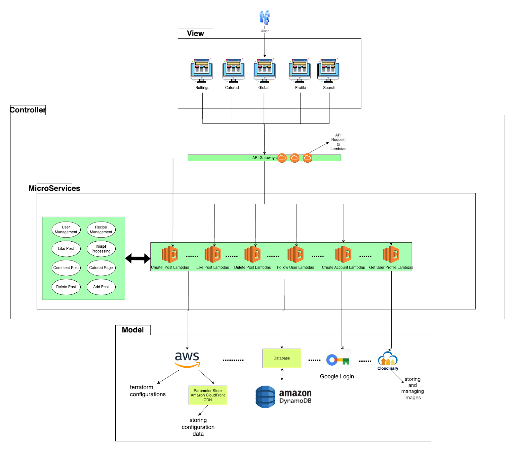
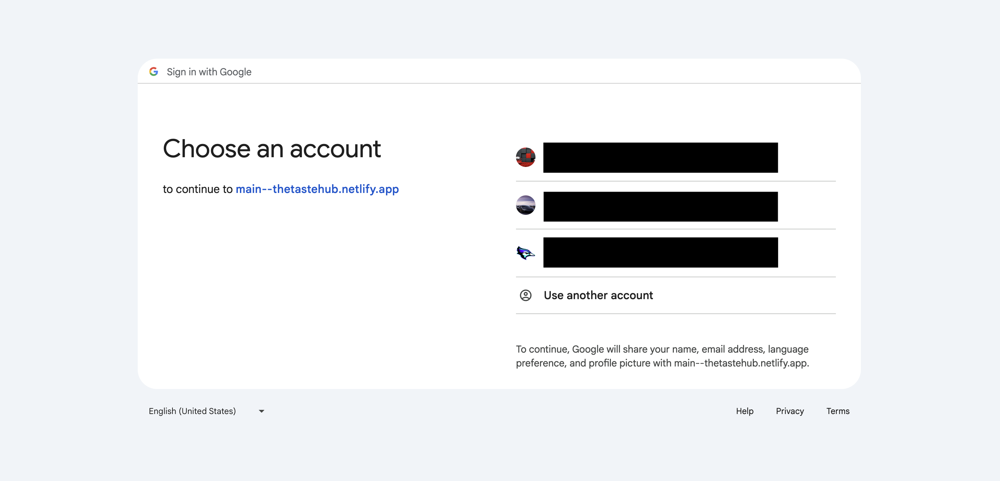
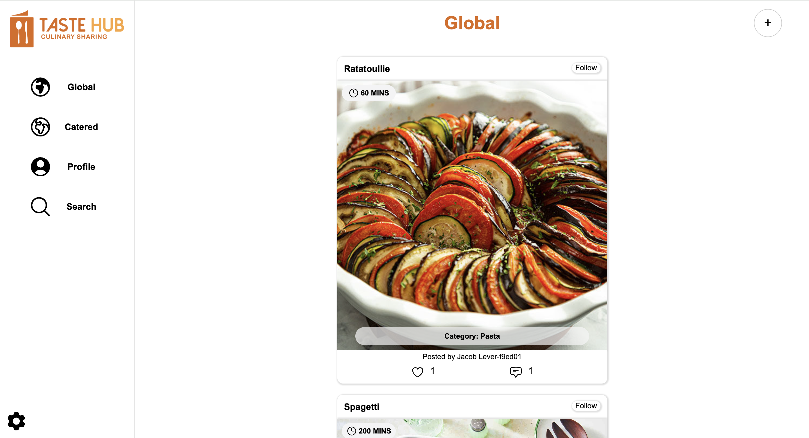
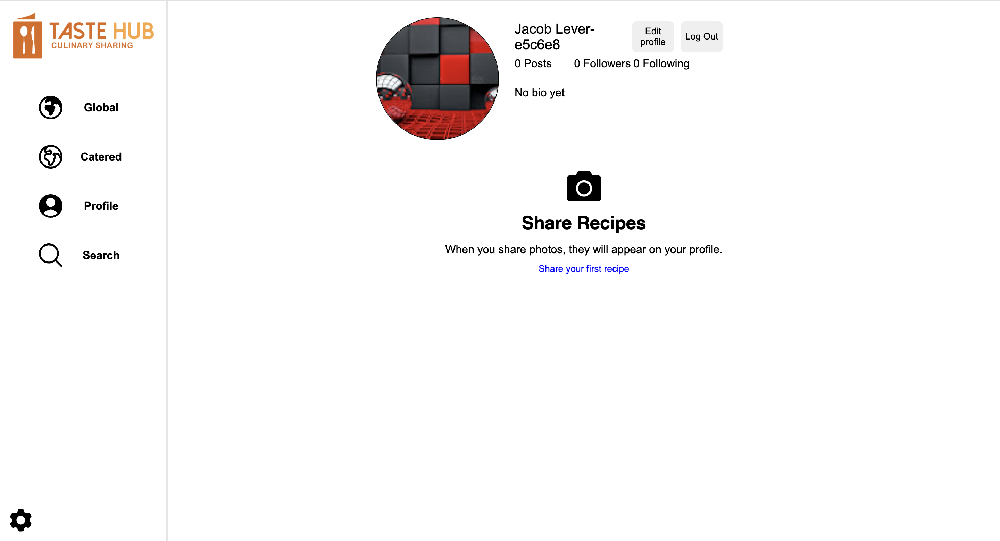
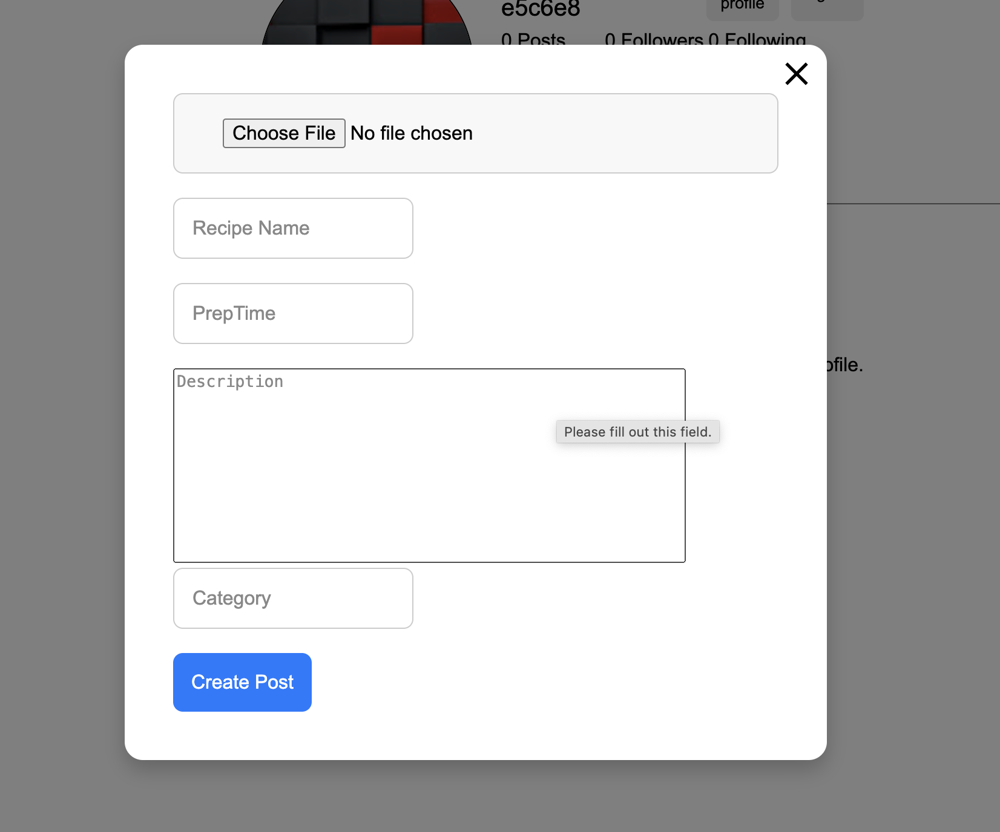
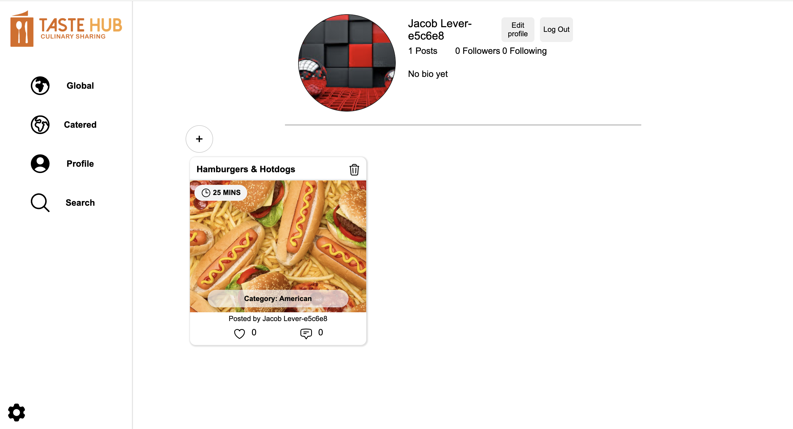
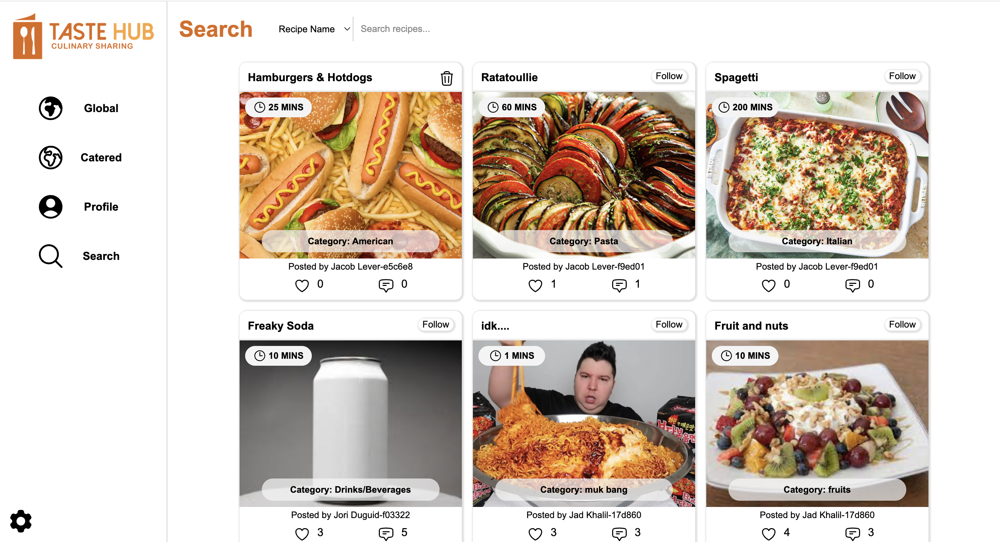
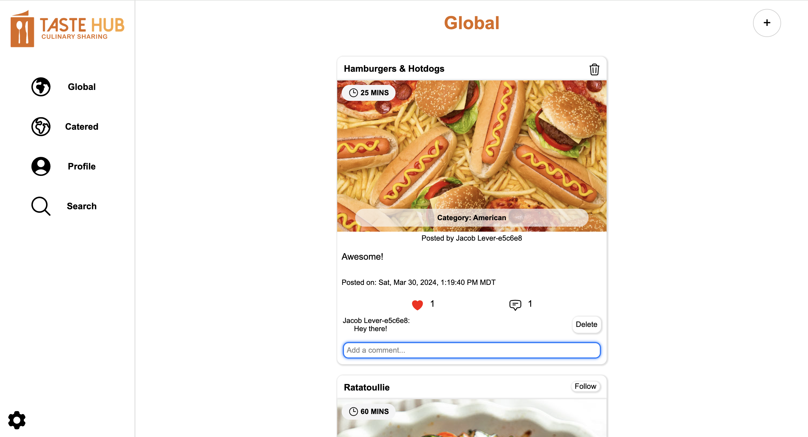
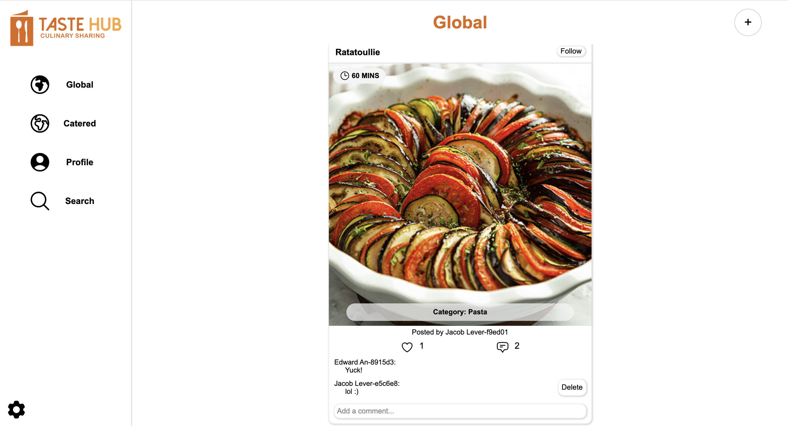
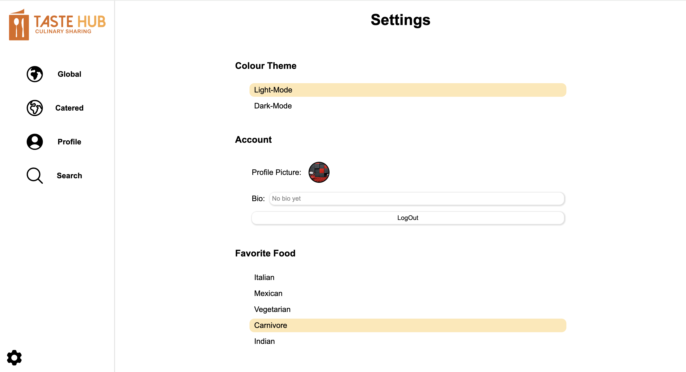

# SENG-401-Term-Project

Hello! This is a copy of my group's term project in SENG 401 at the University of Calgary! In this project we were tasked with developing a web app that serves as a discussion board. We chose to create a social media platform for sharing recipes, with inspiration taken from TikTok and Instagram, we made a simple yet functional social media platform enabling users to share and interact with their favourite recipes.

Implementation uses the following tools:

 DynamoDB & Lambda Functions

 React

 Dynamic Image Storage

 Google Login API

## Project Architecture Diagram

...more diagrams and descriptions of the project available in the full document [HERE](Project-Final-Report.pdf)

## How-to-use

The application is deployed and can be used here... 
[https://main--thetastehub.netlify.app/](https://main--thetastehub.netlify.app/)

Please note, unfortunately due to the cost limitations of AWS and other services used, this application may not be live when veiwing this repo. 
Screenshots of the main functionalities can be veiwed below...

## Overview

Sign-In/Create-Account page:

Google Login:

Homepage(Global feed):

Profile(new account):

Making a new post:

Search Page:

Commenting UI:

Settings:

